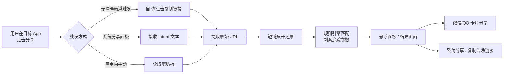
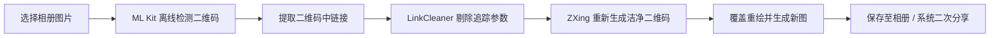

<p align="center">
  
</p>

<h1 align="center">StopTrackingMe · 勿追踪</h1>

<p align="center">
  <strong>专为 Android 打造的极致易用、无感链接与二维码追踪参数净化工具</strong>
</p>

<p align="center">
  <a href="https://github.com/StopTrackingMe-Dev/StopTrackingMe/releases"></a>
  <a href="https://developer.android.com/about/versions/oreo"></a>
  <a href="https://kotlinlang.org/"></a>
  <a href="https://material.io/design"></a>
  <a href="#-隐私与安全边界"></a>
</p>

<p align="center">
  <a href="#-核心亮点">✨ 核心亮点</a> •
  <a href="#-功能特性">🚀 功能特性</a> •
  <a href="#-版本对比-minimal-vs-full">📦 版本对比</a> •
  <a href="#-工作流程">🔄 工作流程</a> •
  <a href="#-快速上手">📖 快速上手</a> •
  <a href="#-隐私与安全边界">🔒 隐私与安全</a> •
  <a href="#-编译与构建">🛠️ 编译构建</a>
</p>

---

## 💡 为什么需要 StopTrackingMe？

在日常使用各类主流 App（如电商、资讯、社交、视频等）分享内容时，导出的分享链接往往夹带了大量用于用户画像、行为追踪、设备识别以及联盟回溯的冗长追踪参数（如 `utm_*`、`spm`、`scm`、`tracker_token`、用户 UID 等）。

传统去除追踪工具通常需要极繁琐的操作流程：
> 1. 打开来源 App 分享 ➔ 2. 点击“复制链接” ➔ 3. 退出到桌面 ➔ 4. 打开净化工具 ➔ 5. 粘贴并净化 ➔ 6. 重新分享至微信/QQ

**StopTrackingMe（勿追踪）** 的核心理念是 **「极致易用 · 告别反复跳转」**。结合 Android 无障碍自动化能力与便捷悬浮窗面板，让你在点击分享的瞬间，即可无感完成参数剥离，并直接以**精美卡片**或洁净链接快速二次分享！

---

## ✨ 核心亮点

<table>
  <tr>
    <td width="50%">
      <h3>🪄 1. 悬浮窗面板与无障碍无感分享 <br><sub><mark>同类软件首创/独家</mark></sub></h3>
      无需手动退出切换应用！在第三方 App 点击分享时，通过无障碍辅助在后台秒级触发“复制链接”，并立即在当前界面弹出<b>悬浮净化面板</b>，去除追踪参数后直接完成二次分享。
    </td>
    <td width="50%">
      <h3>🎴 2. 微信 & QQ 官方 SDK 卡片级分享 <br><sub><mark>同类软件首创/独家</mark></sub></h3>
      告别光秃秃、丑陋冗长的纯文本链接！内置官方微信与 QQ SDK，自动获取网页公开的标题、摘要与封面图，以<b>原生精美卡片（Rich Card）</b>形态一键分享至好友、群聊或朋友圈/空间。
    </td>
  </tr>
  <tr>
    <td width="50%">
      <h3>🖼️ 3. 图片与相册二维码追踪净化 <br><sub><mark>Full 版本独家</mark></sub></h3>
      支持从相册选择包含推广二维码的图片/海报，本地高精度识别图中二维码，剥离其承载的追踪跳转参数，并<b>原位重新绘制生成洁净二维码图片</b>，可直接保存相册或分享。
    </td>
    <td width="50%">
      <h3>🔄 4. 多渠道分享与剪贴板极速识别</h3>
      不仅支持无障碍悬浮触发，还支持通过系统<b>「发送到 / 分享到」</b>菜单调用；亦可打开应用界面秒级自动读取剪贴板并解析净化，满足各种习惯与使用场景。
    </td>
  </tr>
</table>

---

## 🚀 功能特性

- **🛡️ 纯本地精细化参数清洗**
  - 精确剔除 `utm_source`、`utm_medium`、`utm_campaign`、`fbclid`、`gclid`、`spm_id_from` 等各类营销跟踪标记。
  - 智能保留页面正常运作所需的业务参数、分页、片段标识（Fragment）与校验信息，避免链接失效。
- **🌐 安全短链接解析展开**
  - 支持将各类平台短链（如 `b23.tv` 等）自动还原为目标真实 URL 后再执行净化。
  - 内置私网地址拦截与重定向死循环熔断机制，安全可靠。
- **📜 云端订阅与本地规则**
  - 支持添加 HTTPS 规则订阅源，每日启动静默智能更新，无需频繁更新 APK。
  - 支持本地导入 JSON 规则文件，针对特定应用量身定制匹配规则。
- **🎨 现代 Material 3 设计与全平台架构**
  - 采用 Jetpack Compose 全新构建，支持深色模式与动态取色。
  - 提供 Universal、arm64-v8a、armeabi-v7a、x86_64 完整架构包。

---

## 📦 版本对比 (Minimal vs Full)

项目提供两个针对不同需求的构建风味（Flavors）：

| 特性 / 能力 | Minimal (精简版) | Full (全功能版 - 推荐) |
| :--- | :---: | :---: |
| **无障碍自动化复制与悬浮分享** | ✅ | ✅ |
| **系统分享接管 & 剪贴板自动净化** | ✅ | ✅ |
| **微信 / QQ 官方卡片级二次分享** | ✅ | ✅ |
| **短链安全展开与域名重定向** | ✅ | ✅ |
| **云端 HTTPS 规则订阅与本地导入** | ✅ | ✅ |
| **相册图片二维码识别与重绘净化** | ❌ *(体积更轻量)* | ✅ *(集成 ML Kit 离线识别)* |
| **适用人群** | 追求极小安装包体积的用户 | 追求全能体验、常需分享图片海报的用户 |

---

## 🔄 工作流程

### 1. 链接净化与分享流程


### 2. 相册图片二维码净化流程 (Full 版本)


---

## 📖 快速上手

### 1. 安装与初始化
1. 从 [Releases 页面](https://github.com/StopTrackingMe-Dev/StopTrackingMe/releases) 下载最新版本的 APK（推荐下载 **Full** 版本）。
2. 打开应用，根据引导完成基础设置：
   - **开启无障碍服务**：用于在分享时精准查找并自动点击“复制链接”。
   - **配置电池无限制**：避免系统后台休眠无障碍服务，保证即点即响应。
   - **授予悬浮窗权限**（可选）：启用悬浮窗模式，享受免切屏分享体验。

### 2. 添加规则订阅
- 进入应用底部 **「规则」** 选项卡。
- 粘贴 HTTPS 规则订阅地址并点击 **「下载预览并确认信任」**，即可一键享受最新的应用匹配与参数净化规则。

### 3. 日常分享使用
- **方式 A（悬浮快捷）**：在支持的 App（如各大资讯、视频、社交 App）中打开分享界面，点击出现的悬浮净化按钮，即可在弹出的面板中一键二次分享。
- **方式 B（系统分享）**：在任意 App 分享时，选择“净链分享助手 / StopTrackingMe”。
- **方式 C（图片净链）**：在首页点击“选择二维码图片”，处理完毕后一键导出洁净海报。

---

## 🔒 隐私与安全边界

**StopTrackingMe 恪守严格的隐私安全底线，全链路贯彻 Local-First 本地优先原则：**

- 🛡️ **纯本地处理**：所有的无障碍节点匹配、正则参数清洗、二维码识别与图像重绘均在手机本地执行，绝不向任何远端服务器上传剪贴板文本、用户数据或链接内容。
- 🚫 **严苛的无障碍安全红线**：无障碍服务仅用于在用户触发时单次查找并点击“复制链接”。代码层面对敏感控件（如“发送”、“支付”、“确认”、“登录”、“添加好友”等）施加绝对拦截，严禁任何未经授权的自动化操作。
- 🔏 **透明可控的 SDK 交互**：QQ 互联 SDK 仅在用户明确同意授权后初始化；微信与 QQ 分享仅向官方客户端传输经用户确认的净化链接、标题和封面，不留存用户通讯录或会话信息。

---

## 🛠️ 编译与构建

### 环境要求
- **Android Studio**: Ladybug (2024.2.1) 或更高版本
- **JDK**: OpenJDK 17 或 21
- **Android SDK**: `compileSdk = 36`, `minSdk = 26`
- **Gradle**: 8.x

### 构建步骤
```bash
# 克隆仓库
git clone https://github.com/StopTrackingMe-Dev/StopTrackingMe.git
cd StopTrackingMe

# 编译 Minimal 版本 Debug APK
./gradlew assembleMinimalDebug

# 编译 Full 版本 Release APK
./gradlew assembleFullRelease
```

产物输出路径：`app/build/outputs/apk/`

---

## 🤝 参与贡献与反馈

欢迎提交 Issue 或 Pull Request 来帮助我们改进 StopTrackingMe！

- **规则贡献**：若发现某些 App 的链接有新型追踪参数或未成功匹配，欢迎提交规则 PR 或反馈规则样本。
- **功能建议与 Bug 报告**：请前往 [GitHub Issues](https://github.com/StopTrackingMe-Dev/StopTrackingMe/issues) 提交。

---

## 📄 开源许可证

本项目遵循开源协议，详情请参阅 [LICENSE](LICENSE) 文件。
*本项目中所涉及的第三方 SDK（微信 OpenSDK、QQ 互联 SDK、ML Kit 等）之版权归其各自所有者所有。*

<p align="center">
  <sub>Made with ❤️ by the StopTrackingMe Community. Keep your links clean and safe.</sub>
</p>
